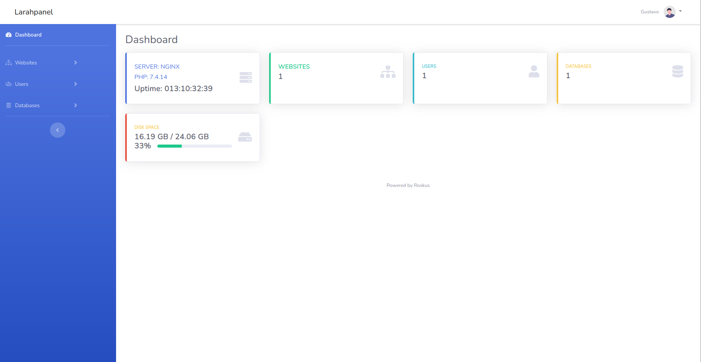

# LPanel: Web Hosting Panel

Open Source web hosting panel based in Laravel

[](https://github.com/Roskus/lpanel/actions/workflows/laravel.yml)

### Login


### Dashboard


## Features

* Virtual Host administration
  * Nginx
  * Apache
* Database administration
  * MariaDB / MySQL
  * Postgres
* Linux user administration

## Setup docker
```terminal
docker-compose build
docker-compose up -d
```

## Setup
Clone project
```terminal
git clone git@github.com:Roskus/lpanel.git
```
Just run make
```terminal
make install
```

## Commands

### User panel create

```terminal
php artisan panel:user:create
```

### Create a website virtual host by default create a nginx virtualhost

```terminal
php artisan panel:website:create domain.com
```

### Create a website virtual host with apache virtualhost

```terminal
php artisan panel:website:create domain_data server=apache
```

### Create a database by default use MariaDB

```terminal
php artisan panel:database:create dbname
```

### Create a database by type

```terminal
php artisan panel:database:create dbname type=postgresql
```

### Create a database user

```terminal
php artisan panel:database:user-create
```

### Create a linux user

```terminal
php artisan panel:linux:user-create name
```

## Tests

Run tests
```terminal
php artisan test
```

## Made with ❤️

#### Design based in StartBootstrap

https://github.com/startbootstrap/startbootstrap-sb-admin-2

#### Login photo by Brett Sayles

https://www.pexels.com/photo/white-and-blue-cables-2881233

#### TLD list

https://data.iana.org/TLD/tlds-alpha-by-domain.txt
